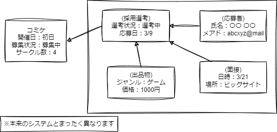

# **ドメイン駆動設計とは**

## **はじめに**

ドメイン駆動設計(Domain Driven Design)とはエリック・エヴァンスが提唱した、「ユーザーが従事する業務に合わせてソフトウェア開発する手法、ドメイン駆動設計」に端を発する、ドメイン(システムの対象領域)知識のソフトウェアの反映に焦点をあてた設計手法。ユーザーファーストの考え方。

## **ドメイン駆動設計とは具体的に**

ソフトウェアを開発する上で、ソフトウェアを利用するユーザーを取り巻くセカイについて知ることはとても重要なことですが、開発者が学び得た、知識は必ずしもすべて有益なものとは限りません。利用者にとって役に立つものを開発するためには、価値のある知識と無価値な知識を見極めて、コードに落とし込んでいく必要があります。

必要な知識は不必要な知識かどうかを見極めるために必要なことは利用者を取り巻くセカイについて学習していくことが必須ですが、何が重要な事柄かどうかはそのセカイのありように左右されてしまいます。価値あるソフトウェアを構築するためには利用者の問題をキャッチして、解決への最善手を考え続ける必要があります。**ドメイン駆動設計**とは、そういった洞察を繰り返し行いながら設計をし、ソフトウェア利用者を取り巻くセカイと実装を結びつけることを目的としています。

## **ドメイン知識に焦点をあてた設計手法**

そもそもドメインとは何か？ドメインとは「領域」という意味を持つ言葉で、ソフトウェア開発におけるドメインとはプログラムを適用する対象となる領域のことを言います。では対象となる領域とは一体なんなのかについて、例えばカメラ業界には”被写体”や”撮影環境”といった概念が存在しますが、これらがドメインに該当します。つまり**ドメイン知識に焦点をあてた設計手法**とは、ソフトウェア利用者が住むセカイの概念や事象などを理解して、その中から問題解決に役立つものをピックアップし、実装に落とし込んでいく方法のことを言います。

## **ドメインモデリング**

ドメインを実装に落とし込むためにはドメインそのもののことだったり、ドメインの関係性などの理解を深めないといけませんが、そんなときに登場するのが**ドメインモデリング**です。ドメインモデリングの手法の一つとしてsudoモデリングというものが存在します。

## **sudoモデリング**

sudoモデリングとは「システム関連図(s)」、「ユースケーズ図(u)」、「ドメインモデル図(d)」、「オブジェクト図(o)」の4つのモデル図の頭文字を取ったものです。

### **1.システム関連図とは**

開発するシステムと、それに関連するアクターや外部システムとの関連を示す図です。

例えばコミケシステムにおいて、応募者(アクター)は応募ページからサークル情報の登録や出品したい創作物の登録などを行います。また、コミケ運営(アクター)は選考管理システムから登録情報を見たり、選考状況や結果日時などをサークルに対してメールを送ったりします。

### **2.ユースケース図**

ユーザーの要求に対してシステムがどのように振る舞うかを定義する図です。ユースケース図を作成するときには、ドメインモデル図作成の対象となるシステムを限定します。

今回は選考管理システムに焦点をあてると、サークル情報の登録を行ったり、選考状況や結果発表日時の設定を行ったりします。

### **ドメインモデル図**

ドメインモデル図はクラス図の簡易版のようなものです。ただしクラス図と違って属性は重要なものだけを記述すればよく、メソッドは書く必要がありません。

### **オブジェクト図**

オブジェクト図はドメインモデル図の具体例を図に書き起こしたものです。

▲ドメインモデル図

▲オブジェクト図

参考にしたサイト
[簡単にできるDDDのモデリング-ドメイン駆動設計](https://little-hands.hatenablog.com/entry/2022/06/01/ddd-modeling)